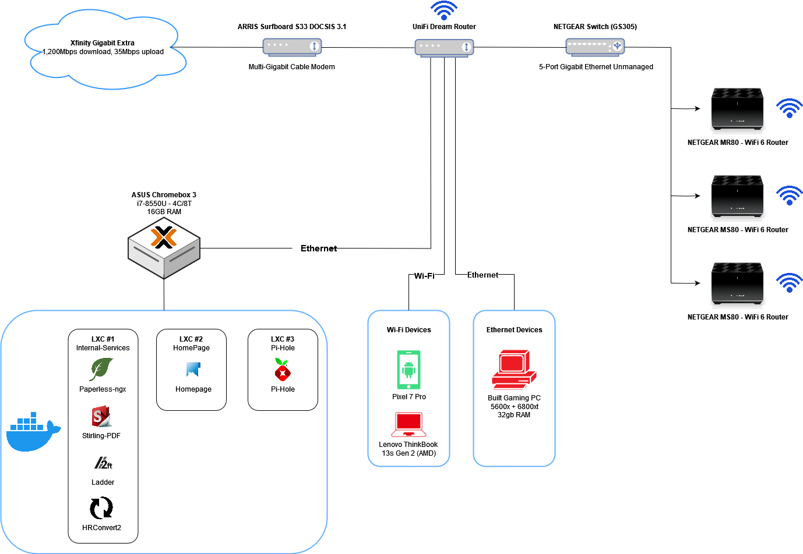

# Homelab Documentation

Welcome to my homelab documentation repository! This repository serves as a collection of documentation for my personal homelab setup.

## Overview

In this repository, you will find detailed information about the various components and configurations of my homelab. This includes hardware specifications, network setup, virtualization platforms, containerization technologies, and any other relevant details.

## Contents

The repository is organized into the following sections:

- [Hardware](./Markdown/hardware.md): Provides information about the physical hardware used in my homelab, including servers, networking equipment, and storage devices.
- [Network](./Markdown/network.md): Describes the network architecture and configuration, including IP addressing, VLANs, and firewall rules.
- [Virtualization](./Markdown/virtualization.md): Covers the virtualization platforms and technologies used in my homelab, such as VMware ESXi, Proxmox, or Hyper-V.
- [Containers](./Markdown/containers.md): Discusses the containerization technologies employed, such as Docker or Kubernetes, and provides details on containerized applications and services.
<!-- - [Monitoring](./Markdown/monitoring.md): Explains the monitoring tools and practices used to keep track of the homelab's performance and health.
- [Backup and Recovery](./Markdown/backup-recovery.md): Outlines the backup and recovery strategies implemented to protect data and ensure business continuity. -->

## Network Diagram

## Contributing

If you have any suggestions, improvements, or questions regarding the documentation, feel free to open an issue or submit a pull request. Your contributions are greatly appreciated!

## Useful Links

- [r/homelab](https://www.reddit.com/r/homelab/): Welcome to your friendly /r/homelab, where techies and sysadmin from everywhere are welcome to share their labs, projects, builds, etc.

- [r/selfhosted](https://www.reddit.com/r/selfhosted/): A place to share, discuss, discover, assist with, gain assistance for, and critique self-hosted alternatives to our favorite web apps, web services, and online tools.

- [Proxmox VE Helper-Scripts](https://github.com/tteck/Proxmox): Scripts for Streamlining Your Homelab with Proxmox VE

## License

This repository is licensed under the [MIT License](./LICENSE). Feel free to use the information provided here as a reference or inspiration for your own homelab projects.

